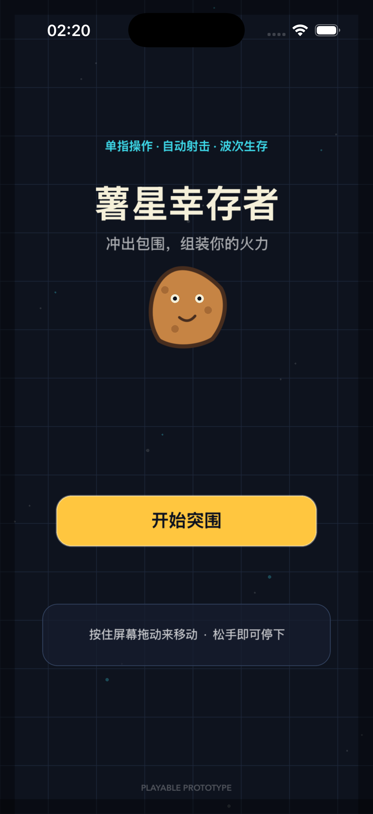
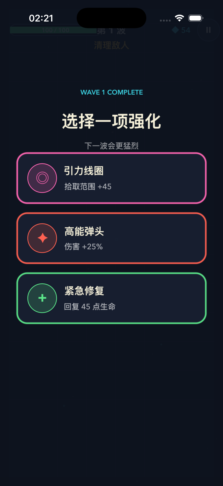
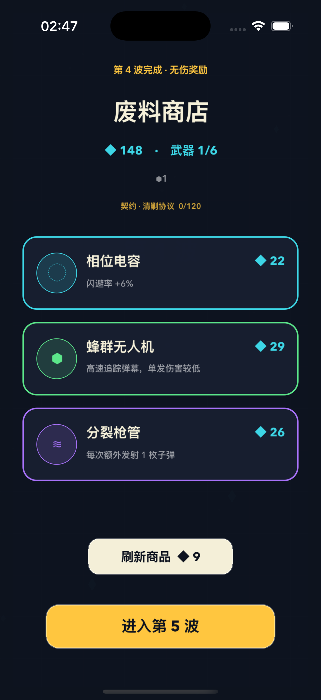
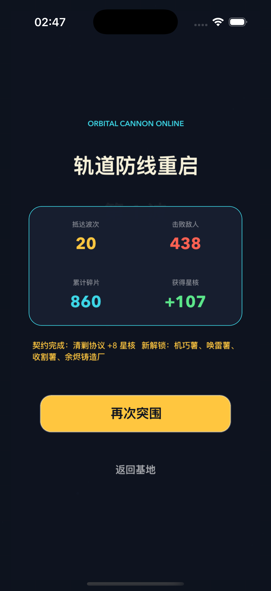

# 薯星幸存者

一个使用 Swift、SwiftUI 和 SpriteKit 制作的原生 iOS 生存射击游戏。当前版本已经包含完整的 20 波战役、局内构筑与可保存的局外成长。

## 游戏画面

<p align="center">
  
  
  
  
</p>

## 已实现

- 16 名可解锁角色，各自改变属性、武器槽、经济或构筑规则
- 24 种双标签武器、I–IV 品质、自动合成、出售与最多 6 武器并行攻击
- 96 件道具，按普通、精良、稀有、传奇四档分布，包含持有上限与复杂联动
- 20 种纯属性升级、四档升级品质和里程碑保底
- 16 类常规敌人、8 种精英词缀、地图专属 Boss 与完整状态系统
- 6 张战区地图、6 档威胁等级、12 份突围合同和 20 波战役
- 霉化风险收益、未拾取资源缓存、无伤奖励、利息、锁定与递增重掷商店
- 10 种武器标签的 2/4/6 件套效果，以及暴击、吸血、闪避、护盾、反伤、召唤等构筑机制
- 星核结算、3 条永久升级路线、角色/地图/威胁渐进解锁和向后兼容存档
- 道具图鉴、世界观档案、战绩记录、辅助倍率、减弱特效与触觉/震动设置
- 开始、选人、选图、威胁、合同、升级、商店、暂停、失败、胜利与再次挑战完整流程
- 原创代码绘制美术、程序化音效与应用图标，无第三方素材依赖

## 运行

需要 Xcode 15 或更新版本，部署目标为 iOS 17.0。

1. 使用 Xcode 打开 `RogSurvivor.xcodeproj`。
2. 选择任意 iPhone 模拟器。
3. 点击 Run。

命令行构建：

```sh
xcodebuild \
  -project RogSurvivor.xcodeproj \
  -scheme RogSurvivor \
  -sdk iphonesimulator \
  -configuration Debug \
  CODE_SIGNING_ALLOWED=NO \
  build
```

## 操作

- 按住屏幕任意非按钮区域，拖动虚拟摇杆移动。
- 武器会自动攻击距离最近的敌人。
- 击败敌人获得星屑和经验；升级时从四张属性卡中选择一张。
- 每波结束进入商店，可购买/出售武器和道具、锁定商品或重掷库存。
- 重复的同名同品质武器会在需要腾出武器槽时自动合成为更高品质。
- 第 20 波结束后完成本轮战役。

实现概览见 [GAME_DESIGN.md](GAME_DESIGN.md)，完整数值与规则见 [DESIGN_BIBLE.md](DESIGN_BIBLE.md)。
